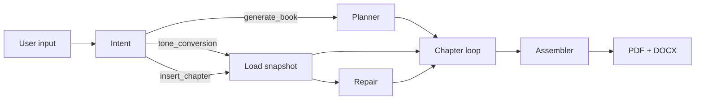

# AIuthor — Agentic Book Generation System

Gateway Digital AI Engineer Assessment: multi-agent LangGraph pipeline that produces publication-ready books with memory, tonality, RAG grounding, observability, and self-healing chapter insertion.

## Quick start

```bash
python -m venv venv
# Windows
venv\Scripts\activate
# Linux/Mac
source venv/bin/activate

pip install -r requirements.txt
cp .env.example .env
# Add GROQ_API_KEY (text agents) and GEMINI_API_KEY (embeddings only; see .env.example Option C)
```

### One-command test runs

```bash
python -m scripts.run_test_a
python -m scripts.run_test_b
python -m scripts.run_test_c
python -m scripts.run_test_d
```

### API + Streamlit demo

```bash
uvicorn api.main:app --reload --port 8000
streamlit run ui/streamlit_app.py
```

POST to `http://localhost:8000/execute` with:

```json
{"user_input": "A 10 chapter beginner guide to personal finance in conversational tone"}
```

If insert position is missing, the API returns `status: "needs_clarification"` with `clarification_message` and `pending_insert`. Retry with `insert_after` and `source_run_id`:

```json
{
  "user_input": "Insert a new chapter in book run abc123",
  "task_type": "insert_chapter",
  "source_run_id": "abc123",
  "insert_after": 4
}
```

Streamlit uses a **chat UI**: ambiguous inserts prompt for a chapter number in the same thread before continuing.

## Architecture

Single entry point (`POST /execute`, Streamlit chat, or CLI) → **LangGraph** routes by `task_type`:



| Layer | Location | Role |
|-------|----------|------|
| Orchestration | `graph/` | StateGraph, routing, `BookState` |
| Agents | `agents/` | Intent, planner, adaptive chapter pipeline, assembler |
| Memory | `memory/` | Facts, callbacks, glossary, snapshots, insert repair |
| RAG | `rag/` + `.chroma/` | Corpus ingest and retrieval per run |
| I/O | `outputs/`, `traces/` | Books, memory JSON, observability logs |

**Chapter pipeline** auto-selects `batch` (all chapters in one call), `combined` (one fused pass per chapter), or `split` (Researcher → Writer → … → Fact Checker) based on context size.

**Memory:** structured JSON per run; **traces:** prompts, agent steps, memory I/O, token ledger.

## Documentation

- [docs/architecture.md](docs/architecture.md) — system overview, layers, agents, data flow
- [docs/workflow-dag.md](docs/workflow-dag.md) — LangGraph DAG, routing table, chapter sub-pipeline
- [docs/memory_schema.md](docs/memory_schema.md)
- [docs/design_decisions.md](docs/design_decisions.md)
- [docs/evals_report.md](docs/evals_report.md)
- Prompt dossier: `dossier/` → `python -m dossier.build_dossier_pdf`

## Test cases (assessment)

| Test | Command | Description |
|------|---------|-------------|
| A | `run_test_a` | 10-chapter personal finance, Conversational |
| B | `run_test_b` | 5-chapter novella, Storyteller |
| C | `run_test_c` | Regenerate ch3 in Academic, Motivational, Witty |
| D | `run_test_d` | Insert chapter after ch4 — self-heal TOC/callbacks/glossary |
