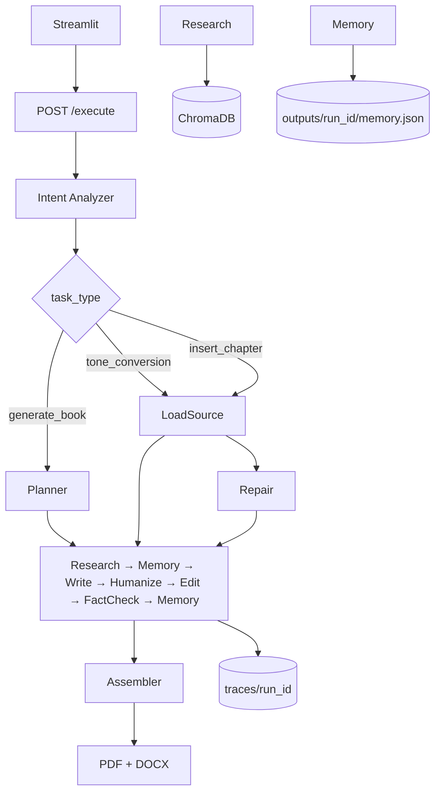

# AIuthor Architecture

## Topology

## Orchestration pattern

**LangGraph StateGraph** with conditional edges on `task_type`. Single natural-language entry point; no per-task REST routes.

| Workflow | Trigger | Path |
|----------|---------|------|
| `generate_book` | New book brief | Intent → Planner → chapter loop → Assembler |
| `tone_conversion` | Regenerate chapter in new tone | Intent → Load snapshot → single chapter loop → Assembler |
| `insert_chapter` | Insert between N and N+1 | Intent → Load → Repair renumber → generate new chapter → Assembler |

## Memory stores

| Store | Location | Contents |
|-------|----------|----------|
| Structured memory | `outputs/{run_id}/memory.json` | Facts, callbacks, glossary, characters, tone fingerprint, decision log |
| Snapshot | `outputs/{run_id}/snapshot.json` | Full run state for Tests C/D |
| Vector RAG | `.chroma/` | Chunked corpus embeddings per collection |
| Traces | `traces/{run_id}/*.jsonl` | Prompts, agent trace, memory I/O, token ledger |

## Data flow

1. User brief → Intent Analyzer (structured JSON).
2. Planner produces `BookOutline`.
3. Per chapter: RAG retrieval → Researcher facts → Memory read → Writer → Humanizer → Editor → Fact Checker → Memory write.
4. Assembler builds manifest (front/back matter in tone) → DOCX/PDF export.

## Failure paths

- Missing API keys: set `MOCK_LLM=true` for structural validation.
- RAG empty: Researcher returns fewer facts; Writer instructed not to invent.
- Fact Checker: softens unverifiable claims; never fabricates ISBNs.
- Insert repair: `memory/repair.py` renumbers chapters and shifts callback/glossary refs before regeneration.

## Model routing

- **Strong** (Planner, Writer, Humanizer, Assembler): GPT-4o or Claude Sonnet.
- **Cheap** (Intent, Researcher extract, Fact Checker, eval judges): GPT-4o-mini or Haiku.
- **Embeddings**: `text-embedding-3-small`
