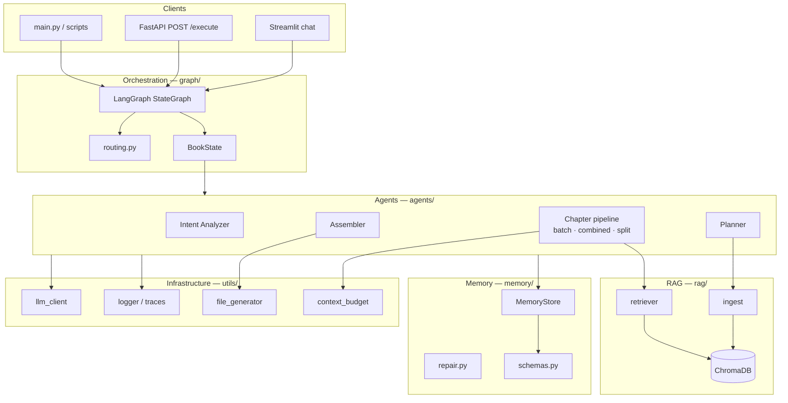
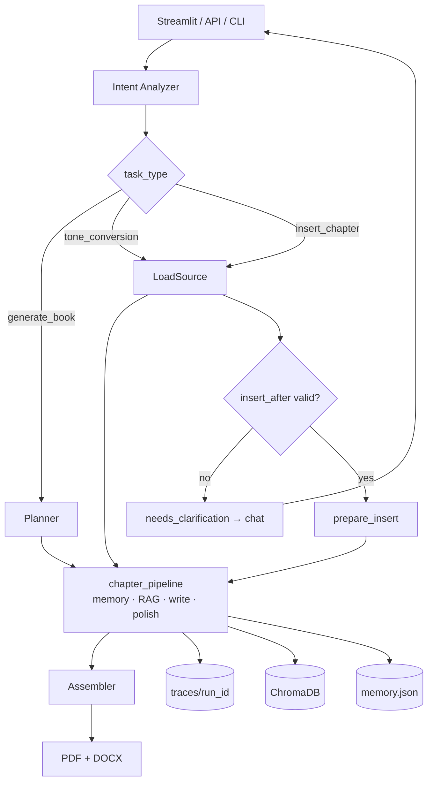

# AIuthor Architecture

Multi-agent book generation system built on **LangGraph**. One natural-language entry point routes to generate, tone-convert, or insert workflows; shared **BookState** flows through LLM agents, structured memory, and RAG.

For node-level graphs and conditional edges, see **[workflow-dag.md](workflow-dag.md)**.

---

## System overview

---

## Repository layout

| Path | Responsibility |
|------|----------------|
| `graph/` | LangGraph workflow, nodes, routing, `BookState` |
| `agents/` | Intent, planner, chapter pipeline, assembler, per-role writers |
| `memory/` | Schemas, JSON store, snapshot load/save, insert repair |
| `rag/` | Corpus chunking, Chroma ingest, retrieval |
| `prompts/` | Agent prompt templates and tonality packs |
| `api/` | FastAPI `POST /execute` |
| `ui/` | Streamlit chat demo and clarification resume |
| `utils/` | LLM client, model routing, context budget, export, tracing |
| `evals/` | Post-run quality checks (tone, callbacks, facts, structure) |
| `scripts/` | Assessment test runners A–D |
| `outputs/{run_id}/` | `memory.json`, `snapshot.json`, `manifest.json`, PDF, DOCX |
| `traces/{run_id}/` | `prompt_log.jsonl`, `agent_trace.jsonl`, `memory_io.jsonl`, `token_ledger.jsonl` |
| `.chroma/` | Vector index per run collection |

---

## Orchestration

**LangGraph `StateGraph`** (`graph/workflow.py`) with conditional edges on `task_type` and chapter counters. No per-task REST routes — the Intent Analyzer classifies the user message.

| Workflow | Trigger | Path |
|----------|---------|------|
| `generate_book` | New book brief | Intent → init_generate → Planner → chapter loop → Assembler |
| `tone_conversion` | Regenerate one chapter in a new tone | Intent → load snapshot → chapter pipeline → Assembler |
| `insert_chapter` | New chapter between N and N+1 | Intent → load → validate position → (clarify if needed) → repair renumber → chapter pipeline → Assembler |
| `export_book` / `repair_book` | Re-export or repair from snapshot | Intent → load → Assembler |

---

## Chapter pipeline (adaptive)

Inside the `chapter_pipeline` graph node, `utils/context_budget.py` selects depth (`chapter_pipeline_mode=auto` by default):

| Mode | When | Agent path |
|------|------|------------|
| **batch** | Few short chapters fit one prompt | `memory_read` → `chapters_batch` → `memory_write` × N |
| **combined** | Default — one pass per chapter | `memory_read` → `chapter_combined` → `memory_write` |
| **split** | Chapter exceeds token budget | `memory_read` → Researcher → Writer → Humanizer → Editor → Fact Checker → `memory_write` |

`memory_read` / `memory_write` are deterministic (no LLM). See [workflow-dag.md §2](workflow-dag.md#2-chapter-pipeline-sub-dag).

---

## Agents

| Agent | Module | LLM | Role |
|-------|--------|-----|------|
| Intent Analyzer | `intent_analyzer.py` | Optional | NL → `task_type`, `brief`, routing hints |
| Planner | `planner.py` | Yes | `BookOutline`, triggers RAG ingest |
| Researcher | `researcher.py` | Optional | Facts from RAG + corpus |
| Memory Keeper | `memory_keeper.py` | No | Read/write fact registry, callbacks, glossary, tone |
| Writer | `writer.py` | Yes | Chapter draft |
| Humanizer | `humanizer.py` | Yes | Voice and rhythm |
| Editor | `editor.py` | Yes | Structure and clarity |
| Fact Checker | `fact_checker.py` | Yes | Ground claims, soften unverifiable |
| Assembler | `assembler.py` | Yes | Front/back matter manifest → export |
| Chapter combined / batch | `chapter_pipeline.py` | Yes | Fused pipeline for cost/latency |

Insert validation and chat prompts: `insert_clarification.py`. Fast intent paths: `intent_heuristics.py`.

---

## Memory & persistence

| Store | Location | Contents |
|-------|----------|----------|
| Structured memory | `outputs/{run_id}/memory.json` | Facts, callbacks, glossary, characters, tone fingerprint, decision log |
| Snapshot | `outputs/{run_id}/snapshot.json` | Full run state for tone conversion and insert (Tests C/D) |
| Vector RAG | `.chroma/` | Chunked corpus embeddings per `run_{run_id}` collection |
| Traces | `traces/{run_id}/*.jsonl` | Prompts, agent trace, memory I/O, token ledger |
| Manifest | `outputs/{run_id}/manifest.json` | Title, chapters, glossary for export |

Schema details: [memory_schema.md](memory_schema.md). Insert renumbering: `memory/repair.py`.

---

## Data flow (generate_book)

1. User brief → **Intent Analyzer** → structured `brief` + `task_type`.
2. **Planner** → `BookOutline`; **ingest** seeds Chroma for the run.
3. For each chapter (loop until `current_chapter > total_chapters`):
   - **memory_read** → context for this chapter
   - **RAG retrieve** → facts and corpus excerpts
   - **chapter_pipeline** (batch, combined, or split) → chapter text in state
   - **memory_write** → update facts, callbacks, glossary, tone
4. **Assembler** → manifest + **PDF/DOCX** in `outputs/{run_id}/`.

---

## Model routing & observability

- **Text agents:** Groq by default (`AGENT_PROVIDERS` in `config.py`); per-agent overrides via env.
- **Embeddings (RAG):** Gemini `gemini-embedding-001` when `GEMINI_API_KEY` is set.
- **Tiers:** `cheap` / `strong` / `reasoning` / `grounded` mapped in `utils/model_routing.py`.
- **Traces:** Every agent logs start/end, prompts, and token usage under `traces/{run_id}/`.
- **Evals:** Optional post-run via API when `AUTO_RUN_EVALS=true` (`evals/run_evals.py`).

### LLM calls per new book (N = chapters)

| Pipeline mode | Approx. LLM calls |
|---------------|-------------------|
| batch | 1 intent + 1 planner + **1** chapter + 1 assembler ≈ **4** |
| combined | 1 intent + 1 planner + **N** + 1 assembler ≈ **N + 3** |
| split | 1 intent + 1 planner + **5N** + 1 assembler ≈ **5N + 3** |

---

## Failure paths

- **Missing API keys:** `MOCK_LLM=true` for structural validation without live models.
- **RAG empty:** Fewer facts; writers instructed not to invent citations.
- **Fact Checker:** Softens unverifiable claims; does not fabricate ISBNs.
- **Insert repair:** `memory/repair.py` renumbers chapters and shifts callback/glossary refs before regeneration.
- **Ambiguous insert:** `status: needs_clarification`; Streamlit chat collects `insert_after` (no silent default).

---

## Related docs

- [workflow-dag.md](workflow-dag.md) — LangGraph nodes, conditional edges, chapter sub-DAG
- [memory_schema.md](memory_schema.md) — JSON memory fields
- [design_decisions.md](design_decisions.md) — tradeoffs and rationale
- [evals_report.md](evals_report.md) — evaluation metrics
