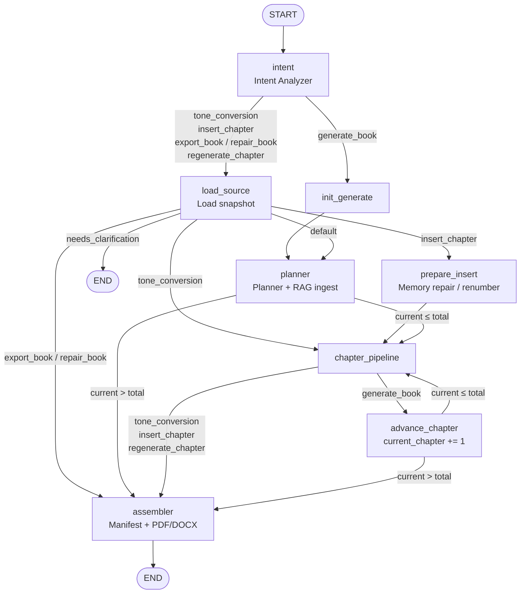
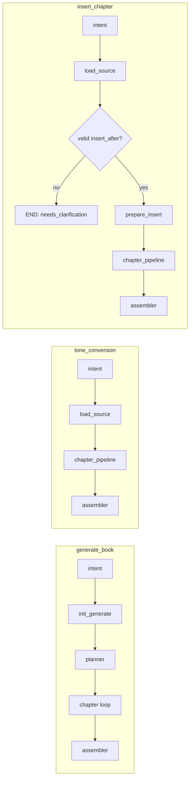
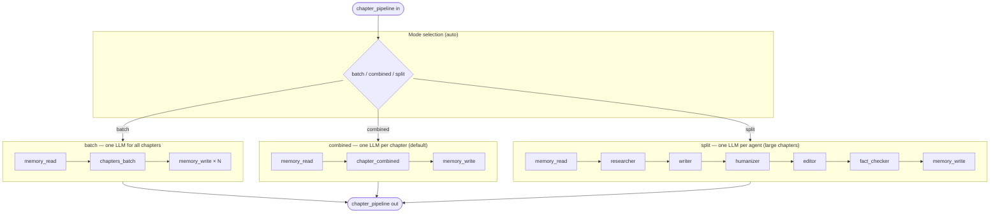
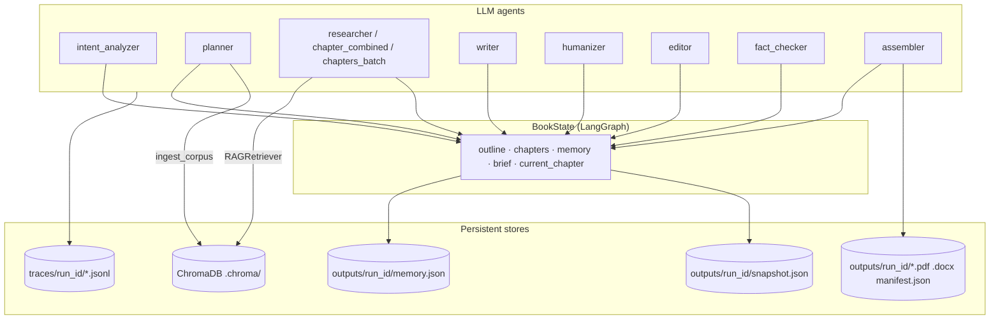

# AIuthor Workflow DAG

Directed acyclic graph for the LangGraph orchestrator (`graph/workflow.py`), chapter pipeline (`agents/chapter_pipeline.py`), and supporting stores.

For system layers, agents, and data flow, see **[architecture.md](architecture.md)**.

## Entry points

| Entry | File | Calls |
|-------|------|--------|
| Streamlit chat | `ui/streamlit_app.py` | `run_workflow()` |
| REST API | `api/main.py` → `POST /execute` | `run_workflow()` |
| CLI | `main.py` | `run_workflow()` |
| Scripts | `scripts/_common.py`, `scripts/run_test_d.py` | `run_workflow()` |

---

## 1. LangGraph orchestrator (top-level DAG)

Nodes are defined in `graph/workflow.py`; routing in `graph/routing.py`.

### Conditional edge reference

| From | Router | Outcomes |
|------|--------|----------|
| `intent` | `route_after_intent` | `generate_book` → `init_generate`; all other tasks → `load_source` |
| `load_source` | `route_after_load` | `needs_clarification` → END; `tone_conversion` → `chapter_pipeline`; `insert_chapter` → `prepare_insert`; `export_book` / `repair_book` → `assembler`; else → `planner` |
| `planner` | `should_continue_chapters` | `chapter_loop` → `chapter_pipeline`; else → `assembler` |
| `chapter_pipeline` | `route_after_chapter_pipeline` | single-chapter tasks → `assembler`; `generate_book` → `advance_chapter` |
| `advance_chapter` | `should_continue_chapters` | loop → `chapter_pipeline`; else → `assembler` |

### Task-type paths

---

## 2. Chapter pipeline sub-DAG

Invoked inside the `chapter_pipeline` node. Mode is chosen by `choose_chapter_pipeline_mode()` in `utils/context_budget.py` (`batch` | `combined` | `split`, or `chapter_pipeline_mode` on state).

| Mode | When | LLM agents | Memory |
|------|------|------------|--------|
| `batch` | Few short chapters fit one prompt | `chapters_batch` | read once, write per chapter |
| `combined` | Default per-chapter budget | `chapter_combined` | read + write per chapter |
| `split` | Chapter exceeds token budget | researcher → writer → humanizer → editor → fact_checker | read + write per chapter |

`memory_read` / `memory_write` are deterministic (no LLM) in `agents/memory_keeper.py`.

---

## 3. Data & side-effect edges

Agents read/write shared `BookState` and external stores (not separate graph nodes).

---

## 4. Agent inventory

| Graph node | Agent module | Role |
|------------|--------------|------|
| `intent` | `agents/intent_analyzer.py` | Parse NL brief → `task_type`, `brief`, routing |
| `load_source` | `memory/memory_store.py` | Load prior run snapshot |
| `prepare_insert` | `memory/repair.py` | Renumber outline/chapters after insert |
| `init_generate` | `graph/nodes.py` | Reset chapter counters for new book |
| `planner` | `agents/planner.py` | `BookOutline` + corpus ingest |
| `chapter_pipeline` | `agents/chapter_pipeline.py` | Adaptive chapter generation |
| `advance_chapter` | `graph/nodes.py` | Increment `current_chapter` |
| `assembler` | `agents/assembler.py` | `BookManifest` + export |

Supporting (non-graph): `agents/insert_clarification.py` (insert validation), `agents/intent_heuristics.py`, `evals/*` (post-run via API when `auto_run_evals`).

---

## 5. State keys that drive routing

| Key | Set by | Used for |
|-----|--------|----------|
| `task_type` | intent | `route_after_intent`, `route_after_load`, `route_after_chapter_pipeline` |
| `status` | load_source (insert invalid) | `needs_clarification` → END |
| `current_chapter` | planner, advance_chapter, batch pipeline | `should_continue_chapters` |
| `total_chapters` | planner, prepare_insert, load_source | chapter loop termination |
| `insert_after` | intent / user / clarification resume | insert path |
| `source_run_id` | intent / load | snapshot source |

Source of truth for graph construction: `graph/workflow.py`, `graph/routing.py`, `graph/nodes.py`, `graph/state.py`.
